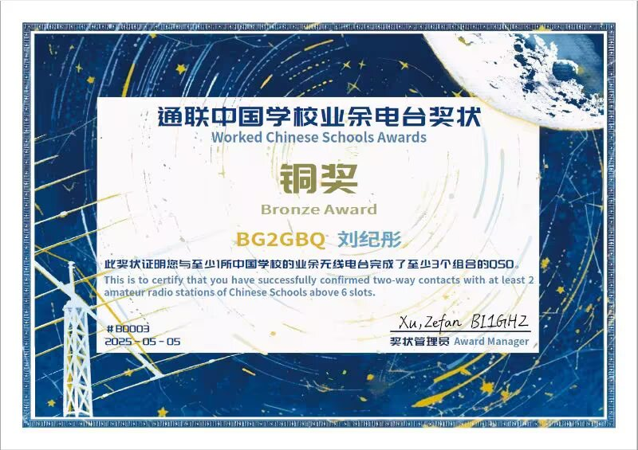

# 通联中国学校业余电台奖状 - WCSA

特别感谢WCSA项目组的支持。

这个奖状的创立目的是为鼓励业余无线电爱好者与中国高等学校、中小学校之业余电台通联，支持学校业余电台发展，让更多青少年参与业余无线电活动。

我很荣幸通过业余卫星与北京航空航天大学（BY1HT）和 重庆南开中学（BG8INK）达成了三次通联，获得了WCSA奖状。

在此特别感谢以上的学校的通联

附图：

通联中国学校业余电台奖状

English Version:

Thank you for supporting WCSA.

The creation of this award is to encourage amateur radio operators to communicate with the amateur radio stations of Chinese schools, support the development of amateur radio stations in schools, and encourage more young people to participate in amateur radio activities.

I am very happy to have achieved three communications with BeiHang University (BY1HT) and Chongqing NanKai Middle School (BG8INK), and have received the WCSA award.

I would like to thank the schools for their communications.

链接/Link:[WCSA - 通联中国学校业余电台奖状](https://www.wcsa.ac.cn/)
