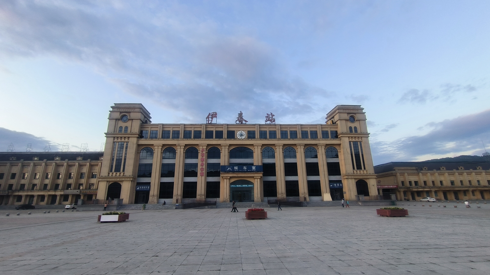
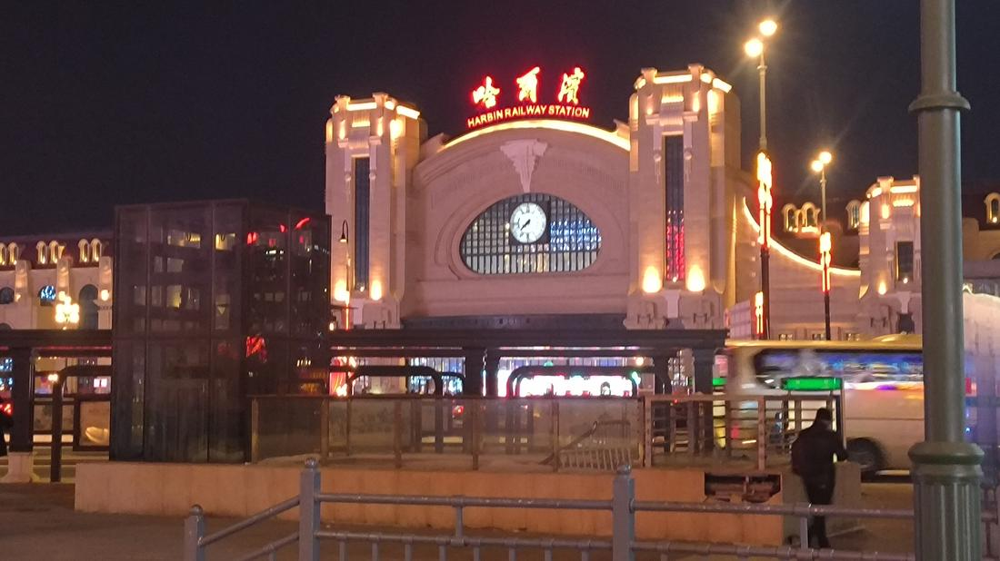
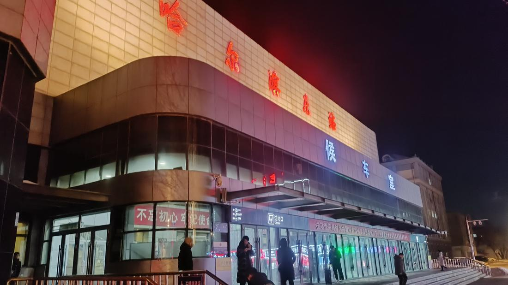
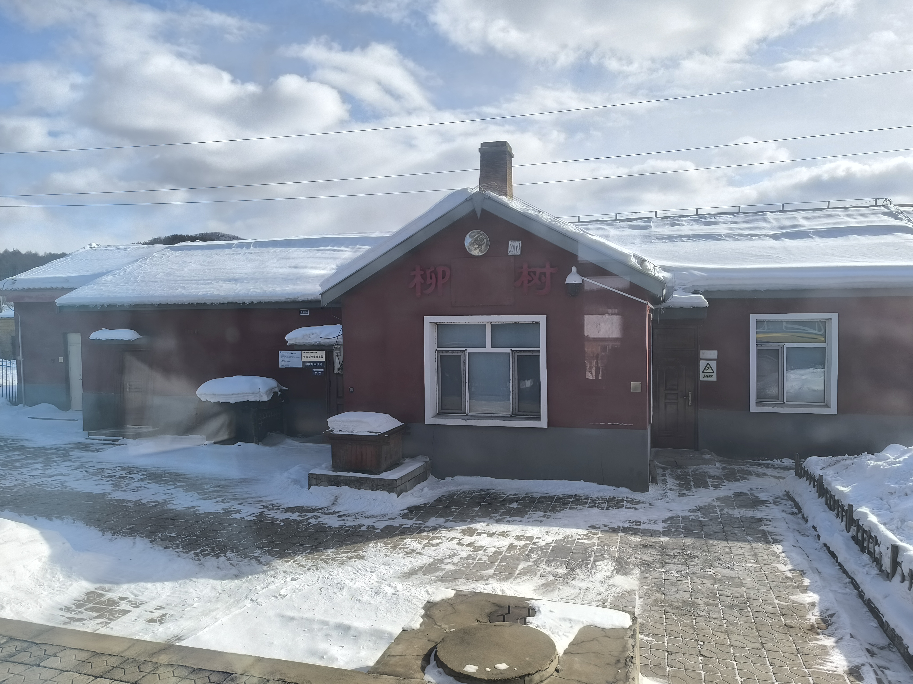
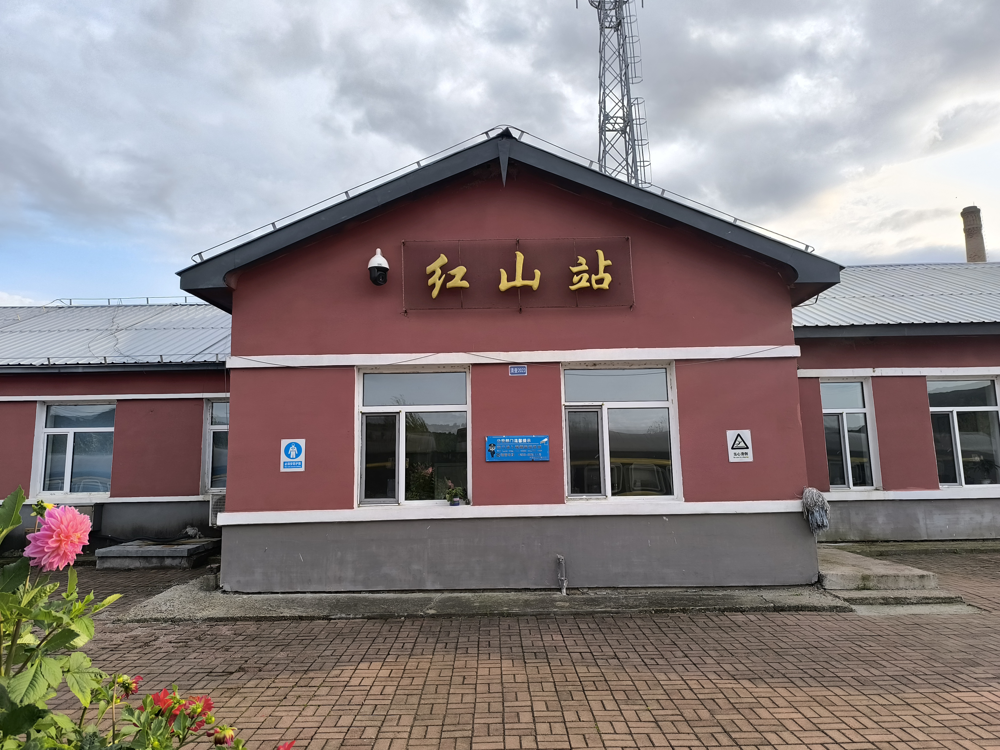
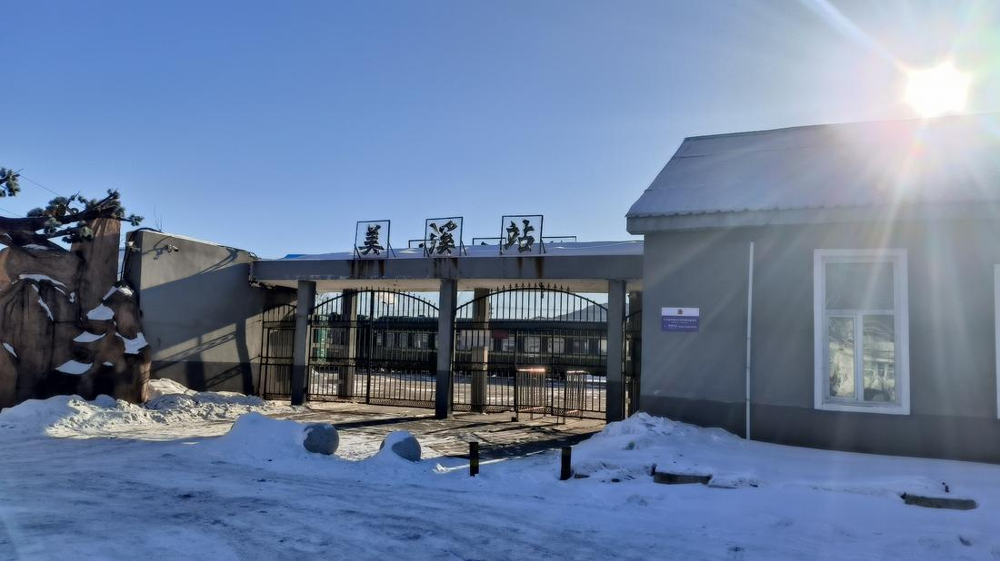
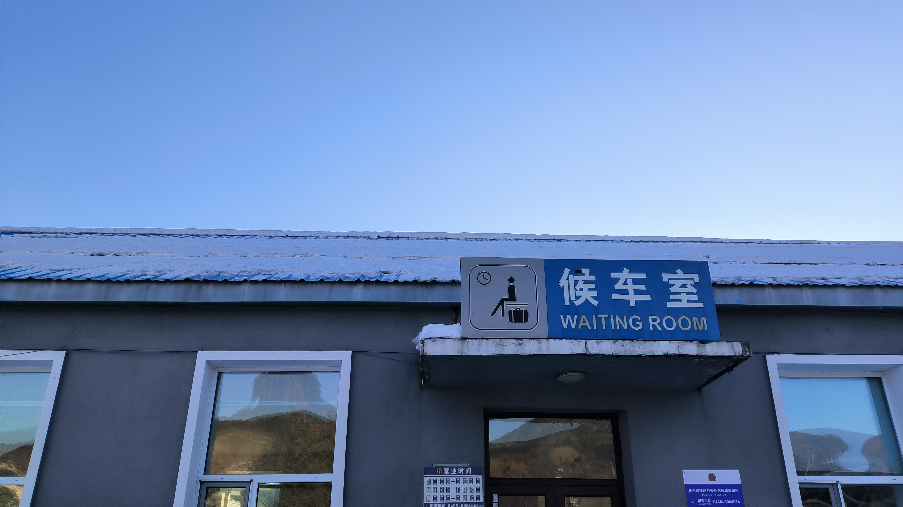
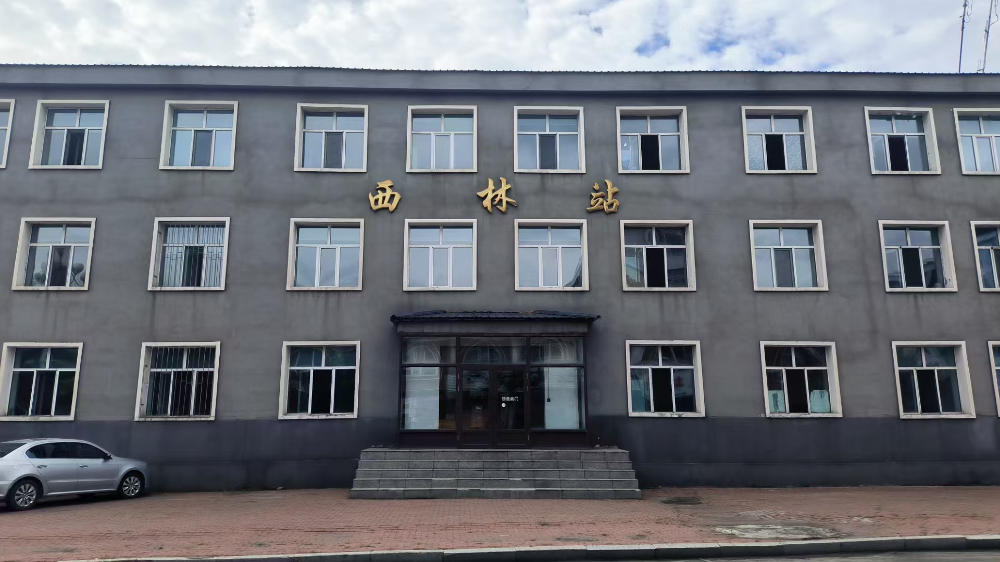
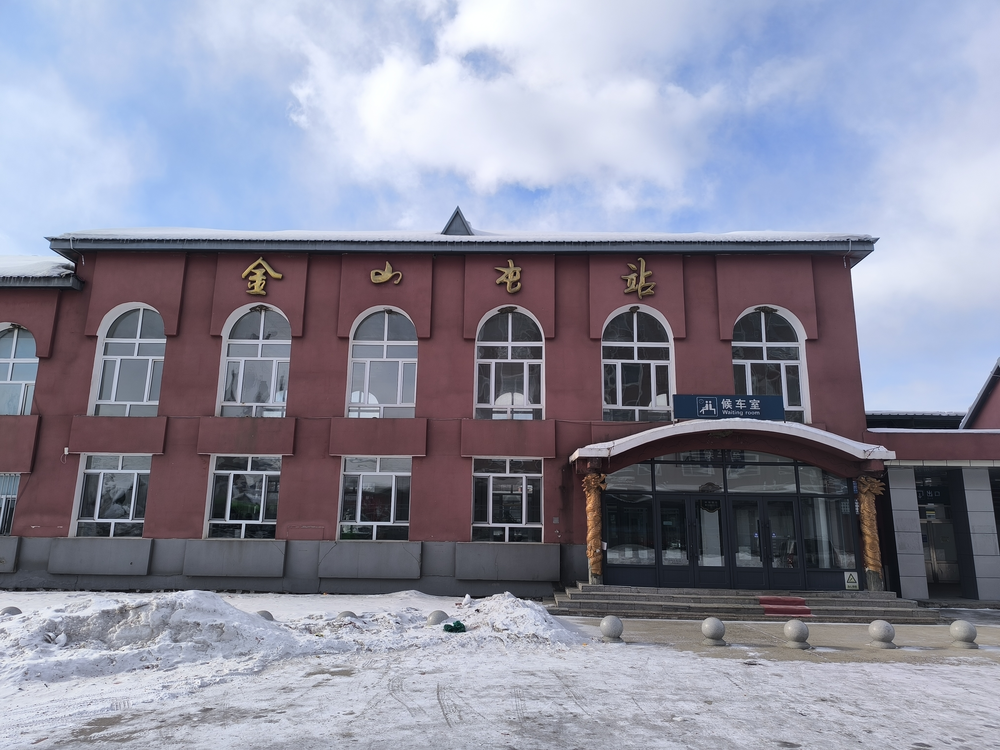

## 乌伊岭.jpg

摘要: 这里是南乌线（也称汤林铁路）的尽头，未来也许有计划延申至嘉荫（黑龙江省伊春市的一个县）或者黑河，本作者也很希望他有朝一日能够实现。

Abstract : Here is the end of the Nanwu Railway (Also call Tanglin Railway), maybe there will be a plan to extend to JiaYin (a county in Yichun City, Heilongjiang Province) or Heihe in the future, and the author also hopes that he will have a day to day to implement.

## 伊春.jpg

摘要: 伊春火车站是一个二等站，高站台，也算是一个比较小的站点，他虽然看起来很高大，但实际使用面积也只有几个凳子组成的候车室和3个窗口组成的售票处，相对来说比其他地级市车站要简陋。

Abstract : Yichun Railway Station is a second-class station with high platforms, which is also a relatively small station. Although it looks tall, the actual area of use is only a waiting room composed of several benches and a ticket office composed of three windows, which is relatively simple compared to other prefecture-level city stations.

## 伊春（全景）.jpg

摘要: Hello

## 南岔.jpg

摘要: Hello

## 友好站（全）.jpg

摘要: Hello

## 哈尔滨.jpg

摘要: Hello

## 哈尔滨东.jpg

摘要: Hello

## 柳树（站内）.jpg

摘要: Hello

## 沙山（站内）.jpg

摘要: Hello

## 红山（站内）.jpg

摘要: Hello

## 红山（站外）.jpg

摘要: Hello

## 绥化.jpg

摘要: Hello

## 美溪.jpg

摘要: Hello

## 美溪候车室.jpg

摘要: Hello

## 西林.jpg

摘要: Hello

## 金山屯.jpg

摘要: Hello

